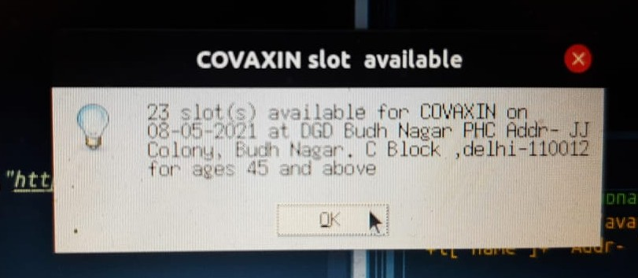

# VAC-INFO
This is a python script to execute API calls to COWIN server of Government of India and give message box and SMS alerts to user if a slot for vaccination in the given pincode is free for registration in the period of next one month.

Required libraries :- requests,json,datetime,tkinter

